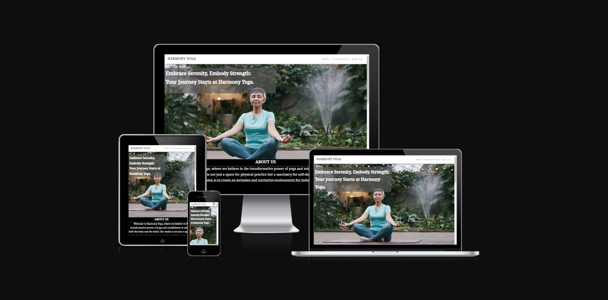
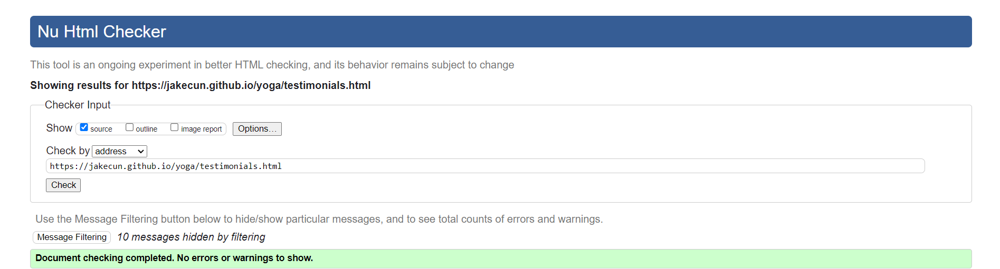
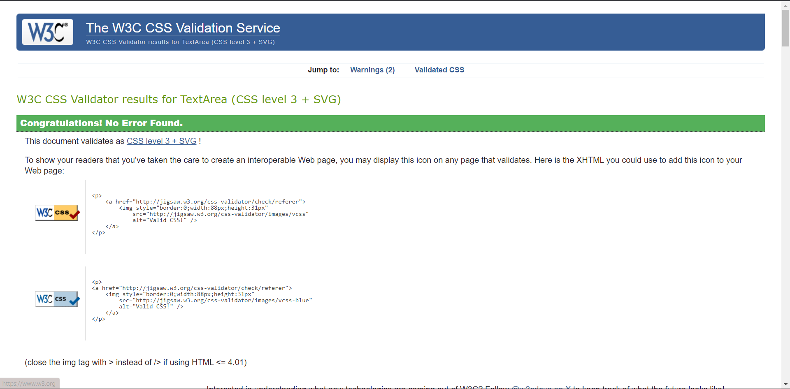

# Harmony Yoga

[Visit the website here](https://jakecun.github.io/yoga/)

Created to provide information for people interested in yoga and looking to start the journey.

This website is made up of the following sections:

1. Introduction/Home
2. About us
3. Meet the team
4. Testimonials
5. Sign up

The goals for this websites are as follows:

1. Provide information to the user interested in yoga.
2. Explain what "Harmony Yoga" is about
3. Give a look at the team members and their specialised fields
4. Give the user first hand information of what to expect via testimonial
5. Allow users to sign up for classes (Yoga classes/Mindfulness coaching)

## Features

### Existing Features

- **Navigation Bar**

  - Featured on all three pages, the full responsive navigation bar includes links to the Logo, Home page, Testimonials and Sign Up page and is identical in each page to allow for easy navigation.
  - This section will allow the user to easily navigate from page to page across all devices without having to revert back to the previous page via the ‘back’ button.

- **Landing Page**
  - The landing includes a photograph with text overlay to allow the user to see exactly which location this site would be applicable to.
  - This section introduces the user to Harmony Yoga with an eye catching image to grab their attention

- **The Footer**

  - The footer section includes links to the relevant social media sites for Love Running. The links will open to a new tab to allow easy navigation for the user.
  - The footer is valuable to the user as it encourages them to keep connected via social media

- **Testimonials**
  - The testimonials page offers insight to what to user can expect from Harmony Yoga, this is achieved by user testimonials and their experience.

- **The Sign Up Page**

  - This page will allow the user to get signed up to Harmony Yoga. The user will be able specify if they would like to take part in Yoga classes or Mindfulness coaching sessions. The user will be asked to submit their full name and email address.

### Features Left to Implement

- Additional features that could be implented are as follows:
  - Scroll to top feature, to speed up the user experience
  - Google maps with Address pinned to help the user find Harmony Yoga

## Testing

When testing from a user standpoint I made sure to check the responsivness on different device types. To ensure that the navigation bar was working correctly on mobile devices and that everything was easily accesessible to the user.

### Validator Testing

- HTML
  - No errors were returned when passing through the official 
  - 
  - 
- CSS
  - No errors were found when passing through the official 

### Unfixed Bugs

An unfixed bug I have encountered is that the nav bar is slightly too short on certain devices and leaves a gap between the main content and the nav bar itself 

## Deployment

I deployed this website by using GitPages and following the below steps:

### _GitHub pages deployment_

1. Log in to GitHub
2. In your Repository section, select the project repository that you want to deploy
3. In the menu located at the top of this section, click 'Settings'
4. Select 'Pages' on the left-hand menu - this is around halfway down
5. In the source section, select branch 'Main' and save
6. The page is then given a site URL which you will see above the source section

The live link can be found here - <https://jakecun.github.io/yoga/index.html>

## Credits

- Code for gradient background on testimonials page was aboatined from [cssgradient](https://cssgradient.io/)

### Content

- Font for text content was taken from [Google Fonts](https://fonts.google.com/noto/specimen/Noto+Serif+Balinese)
- The icons in the footer were taken from [Font Awesome](https://fontawesome.com/)

### Media

- The photos used on the home, testimonials and sign up page are from [Pexels](https://www.pexels.com/)
