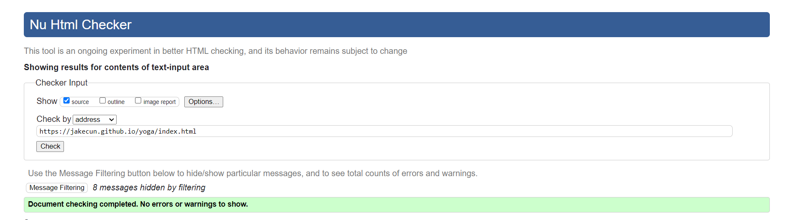
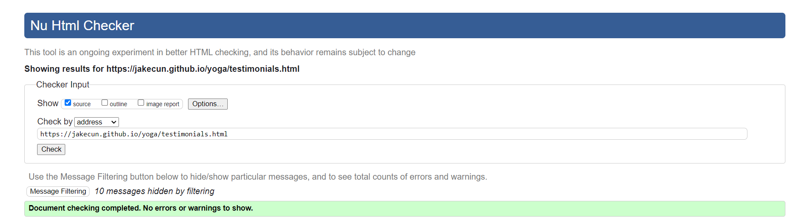
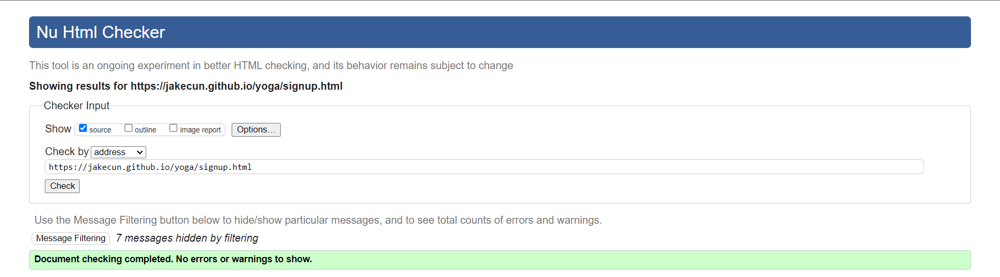
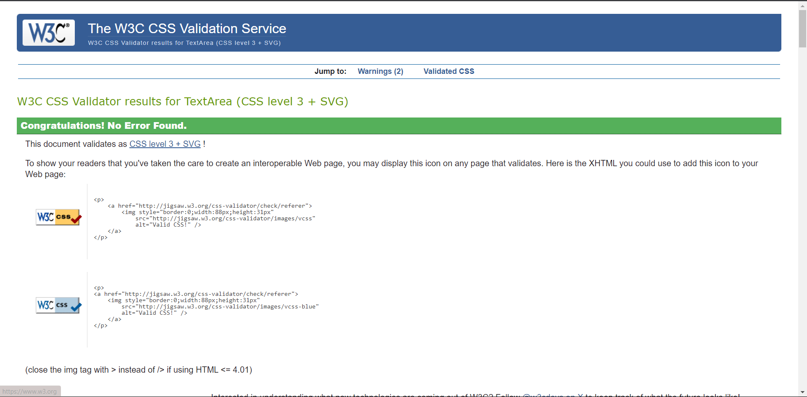

## Features

### Existing Features

- __Navigation Bar__

  - Featured on all three pages, the full responsive navigation bar includes links to the Logo, Home page, Testimonials and Sign Up page and is identical in each page to allow for easy navigation.
  - This section will allow the user to easily navigate from page to page across all devices without having to revert back to the previous page via the ‘back’ button.

- __Landing Page__
  - The landing includes a photograph with text overlay to allow the user to see exactly which location this site would be applicable to.
  - This section introduces the user to Harmony Yoga with an eye catching image to grab their attention

- __The Footer__

  - The footer section includes links to the relevant social media sites for Love Running. The links will open to a new tab to allow easy navigation for the user.
  - The footer is valuable to the user as it encourages them to keep connected via social media

- __Testimonials__
    - The testimonials page offers insight to what to user can expect from Harmony Yoga, this is achieved by user testimonials and their experience.

- __The Sign Up Page__

  - This page will allow the user to get signed up to Harmony Yoga. The user will be able specify if they would like to take part in Yoga classes or Mindfulness coaching sessions. The user will be asked to submit their full name and email address.

### Features Left to Implement

- Additional features that could be implented are as follows:
    - Scroll to top feature, to speed up the user experience
    - Google maps with Address pinned to help the user find Harmony Yoga

## Testing
When testing from a user standpoint I made sure to check the responsivness on different device types. To ensure that the navigation bar was working correctly on mobile devices and that everything was easily accesessible to the user.

### Validator Testing

- HTML
  - No errors were returned when passing through the official 
  - 
  - 
- CSS
  - No errors were found when passing through the official 

### Unfixed Bugs

## Deployment
- The site was deployed to GitHub pages. The steps to deploy are as follows:
  - In the GitHub repository, navigate to the Settings tab
  - From the source section drop-down menu, select the Master Branch
  - Once the master branch has been selected, the page will be automatically refreshed with a detailed ribbon display to indicate the successful deployment.

The live link can be found here - <https://jakecun.github.io/yoga/index.html>

## Credits
### Content
- Instructions on how to implement form validation on the Sign Up page was taken from [Specific YouTube Tutorial](https://www.youtube.com/)
- The icons in the footer were taken from [Font Awesome](https://fontawesome.com/)

### Media

- The photos used on the home, testimonials and sign up page are from  [Pexels](https://www.pexels.com/)